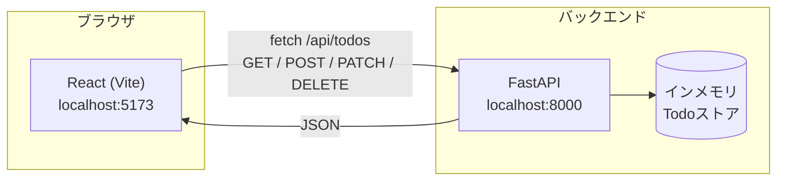
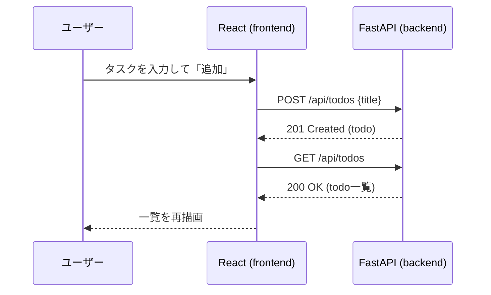

# claude-sandbox-app-v1

FastAPI + React (Vite) によるシンプルなTodoアプリのサンドボックス構成です。

## 構成

- `backend/` — FastAPI製のTodo API（インメモリ保存）
- `frontend/` — React (Vite) 製のフロントエンド





## バックエンドの起動

```bash
cd backend
python3 -m venv venv
./venv/bin/pip install -r requirements.txt
./venv/bin/uvicorn main:app --reload --port 8000
```

- ヘルスチェック: `GET http://localhost:8000/api/health`
- Todo一覧: `GET http://localhost:8000/api/todos`
- Todo作成: `POST http://localhost:8000/api/todos` (`{"title": "..."}`)
- Todo更新: `PATCH http://localhost:8000/api/todos/{id}` (`{"done": true}` など)
- Todo削除: `DELETE http://localhost:8000/api/todos/{id}`

## フロントエンドの起動

```bash
cd frontend
npm install
npm run dev
```

デフォルトで `http://localhost:8000` のAPIを利用します。変更する場合は
`frontend/.env` に `VITE_API_BASE_URL=http://example.com` を設定してください。

ブラウザで `http://localhost:5173` を開くとTodoアプリが表示されます。
